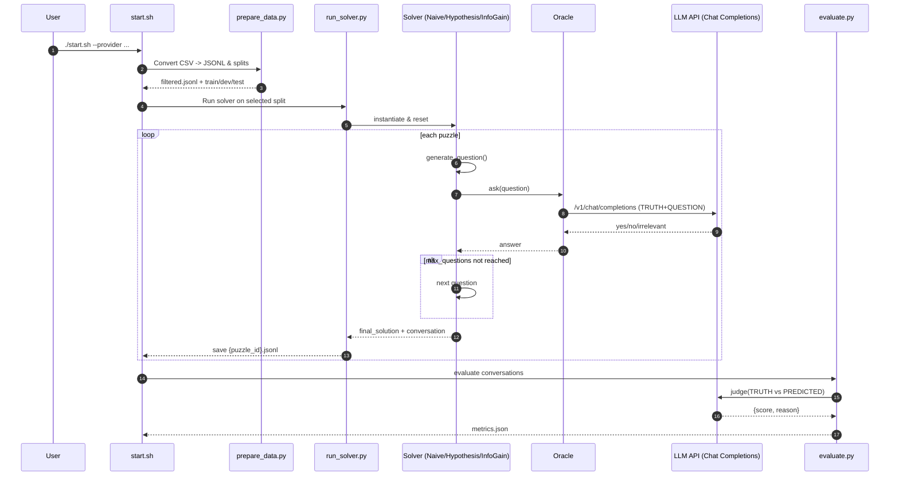

```mermaid
sequenceDiagram
    autonumber
    participant User
    participant Start as start.sh
    participant Prep as prepare_data.py
    participant Run as run_solver.py
    participant Solver as Solver (Naive/Hypothesis/InfoGain)
    participant Oracle
    participant Model as LLM API (Chat Completions)
    participant Eval as evaluate.py

    User->>Start: ./start.sh --provider ...
    Start->>Prep: Convert CSV -> JSONL & splits
    Prep-->>Start: filtered.jsonl + train/dev/test
    Start->>Run: Run solver on selected split
    Run->>Solver: instantiate & reset
    loop each puzzle
        Solver->>Solver: generate_question()
        Solver->>Oracle: ask(question)
        Oracle->>Model: /v1/chat/completions (TRUTH+QUESTION)
        Model-->>Oracle: yes/no/irrelevant
        Oracle-->>Solver: answer
        alt max_questions not reached
            Solver->>Solver: next question
        end
        Solver-->>Run: final_solution + conversation
        Run-->>Start: save {puzzle_id}.jsonl
    end
    Start->>Eval: evaluate conversations
    Eval->>Model: judge(TRUTH vs PREDICTED)
    Model-->>Eval: {score, reason}
    Eval-->>Start: metrics.json
```
